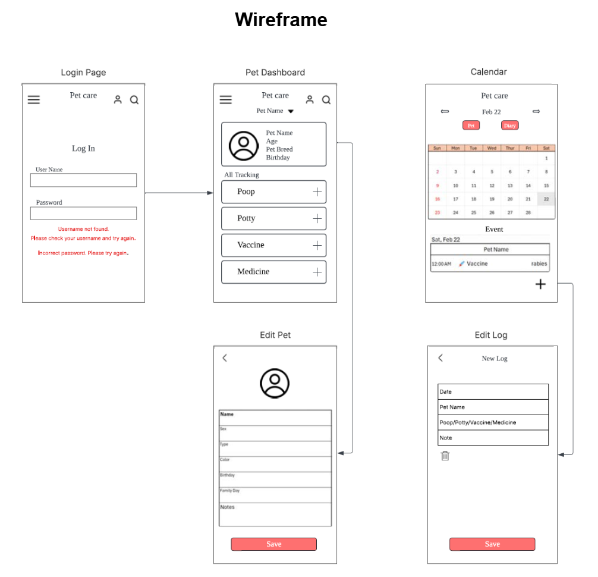
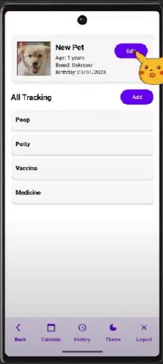
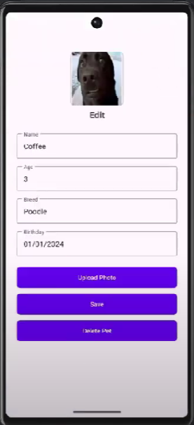
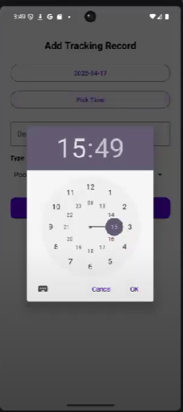
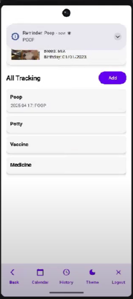
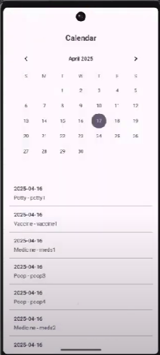

# Pet Care Notifier App 

🎥 Demo Video: <a href="https://www.youtube.com/watch?v=2i_FFPcLEgo" target="_blank">View My Video</a>

🖼️ Preview Image

📋 Description
- PetCare Notifier is an Android application developed to assist pet owners in managing daily care routines for their pets.
- It allows users to register pet profiles, schedule reminders for feeding, medication, and vet visits, and receive push notifications for upcoming tasks — all within a modern and intuitive UI.

✨ Features
- Pet profile creation and editing
- Reminder setup for:
   - Feeding
   - Medication
   - Vet appointments
- Push notifications for scheduled care tasks
- Interactive calendar UI with color-coded days
- Notification log/history view
- Offline-first design, with future cloud sync planned

🛠️ Skills
- Kotlin, Java – Primary language for Android development
- Android Studio – Development environment
- Material Design – UI/UX framework for clean visuals
- NotificationManager & AlarmManager – Android native scheduling
- Java Time API – Date and calendar logic
- Gradle (Kotlin DSL) – Build automation tool
- MVVM Architecture – Organized code structure
